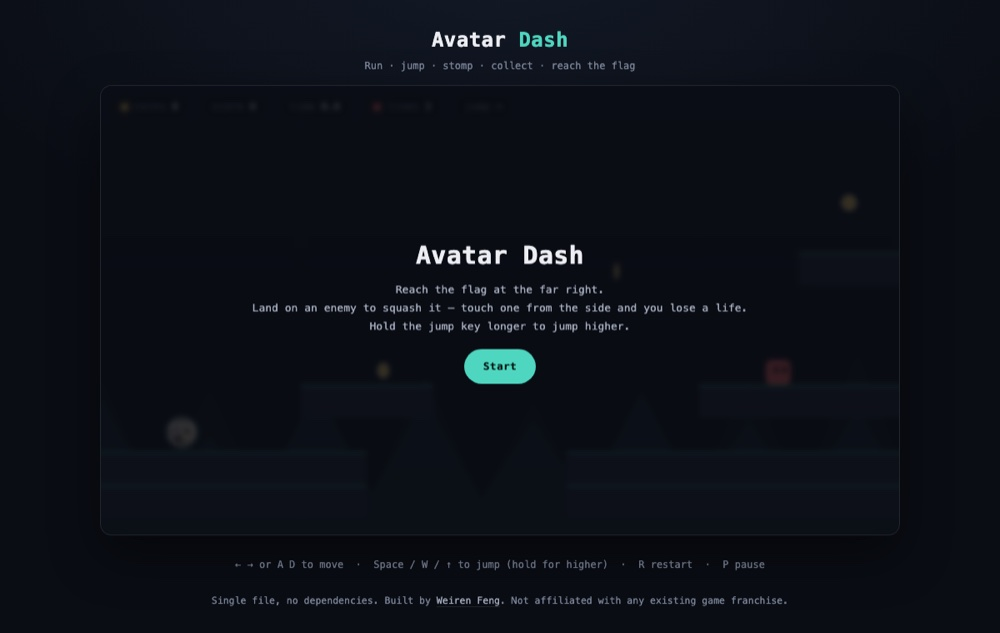

# Avatar Dash

**▶ [Play now](https://renrenmimi.github.io/avatar-dash/)** — runs in your browser, nothing to install.

A side-scrolling platformer where the player character is my GitHub avatar. Run,
jump, stomp the enemies, collect the coins, reach the flag.

*The level, with the avatar on the starting platform*

## Controls

| Action | Keys |
|---|---|
| Move | `←` `→` or `A` `D` |
| Jump | `Space`, `W` or `↑` — hold longer to jump higher |
| Restart | `R` |
| Pause | `P` |

On a touch screen the on-screen buttons appear automatically.

## What is in it

- **Variable-height jumping** — releasing the key early cuts the rise short, so tap height differs from hold height
- **Coyote time and input buffering** — you can still jump for 100 ms after walking off an
  edge, and a jump pressed just before landing still fires.
- **Stomp to kill** — landing on an enemy squashes it and bounces you; touching one from the
  side costs a life
- **Enemies turn at edges** — they check for ground ahead and reverse instead of walking off
- **Fixed timestep physics** at 120 Hz, decoupled from the render loop, so the feel does not
  change with frame rate
- **Parallax background**, screen shake on impact, and particle bursts

## Tech

One HTML file, Canvas 2D. The avatar is embedded as a
base64 data URI, so the page works offline once loaded.

Physics and level layout were verified with a Node script before release: no tunnelling
through blocks at full speed, jump height clears a two-tile gap, the flag has ground under
it, and every enemy stands on a platform.

## A note on naming

This is an original game. It is **not** affiliated with, endorsed by, or derived from any
existing game franchise — no third-party artwork, names, audio, or level data are used. The
genre conventions (run, jump, stomp, flag) are just that: conventions.

---

© 2026 Weiren Feng. All rights reserved.
